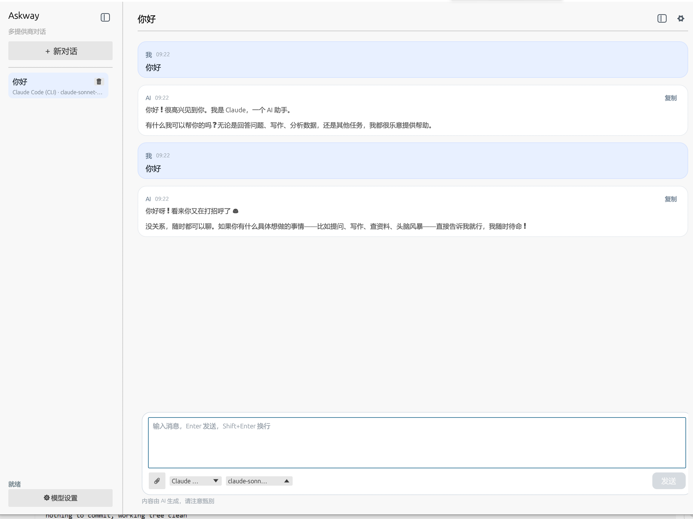
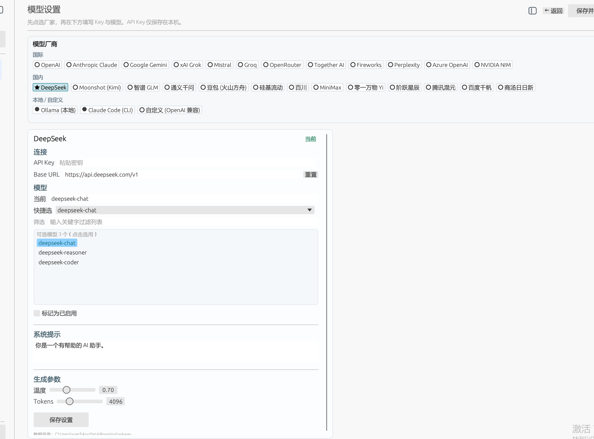

# Askway

纯 Rust 桌面 AI 对话客户端（eframe / egui），无 Web 前端。



## 功能

- 多提供商：OpenAI、Anthropic、Gemini、xAI、Mistral、Groq、OpenRouter、DeepSeek、通义、智谱、豆包、硅基流动等 27 家
- 本地保存 API Key 与会话历史
- 流式输出
- 多会话管理
- 图片 / 文件附件（支持拖拽；图片走多模态，文本文件内联内容）

## 运行

```bash
cargo run --release
```

## 使用

1. 打开 **设置**，选择提供商，填写 API Key（Ollama 本地一般不需要）
2. 点击 **设为当前**，保存
3. 返回对话，输入消息发送（回车发送，`Shift+Enter` 换行）

数据目录：系统用户数据目录下的 `askway/data.json`（若存在旧版 `ai_client` 目录会自动迁移）

## 打安装包（Inno Setup）

前置：安装 [Inno Setup 6](https://jrsoftware.org/isinfo.php)（建议勾选中文语言包）。

一键打包（推荐）：

```bat
pack.bat
```

或 PowerShell：

```powershell
.\packaging\build.ps1
.\packaging\build.ps1 -SkipBuild    # 已有 release 时跳过编译
.\packaging\build.ps1 -OpenDist     # 完成后打开 dist
```

成功后安装包位于 `dist\Askway_Setup_0.1.0.exe`。

## 图标

应用与安装包共用 `assets/` 下图标：

| 文件 | 用途 |
|------|------|
| `assets/icon.ico` | Windows 可执行文件嵌入图标、Inno Setup 安装包图标 |
| `assets/icon_256.png` | 窗口标题栏 / 任务栏运行时图标 |
| `assets/icon.png` | 源图（圆角外透明）；改图后运行 `python assets/make_transparent.py` |
